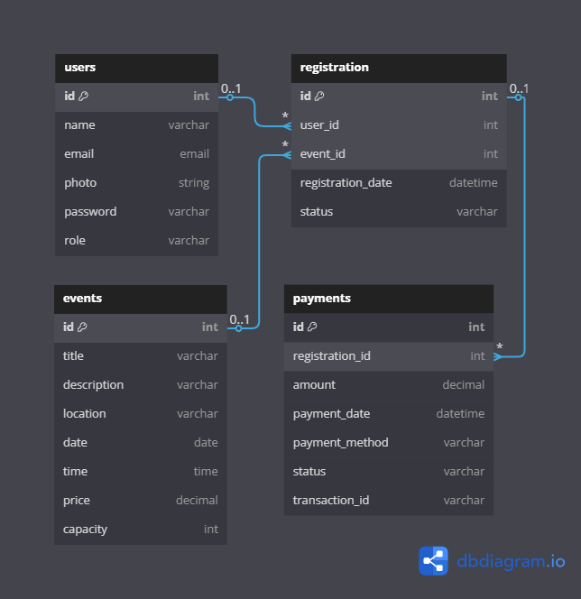

# Event Management System - Laravel 10

## Identitas
- **Nama:** abdel
- **Kelas:** XI PPLG 1
- **Nomor Absen:** 33

## Overview

This project is an Event Management System built with Laravel 10, Tailwind CSS, and Laravel Breeze. It allows admins to create and manage events, while users can browse and register for these events with integrated payment processing via Midtrans payment gateway.

## Features

- Two-tier user system (admin and regular user)
- User authentication and profile management
- Event creation and management (admin only)
- Event registration and ticketing (users)
- Payment processing with Midtrans
- Event search and filtering

## Database Structure

The application uses the following data structure:



## Requirements

- PHP ^8.1
- Composer
- Node.js & NPM
- MySQL/PostgreSQL

## Dependencies

### PHP Dependencies
- Laravel Framework ^10.10
- Laravel Sanctum ^3.3
- Laravel Tinker ^2.8
- Midtrans PHP SDK ^2.6
- GuzzleHTTP ^7.2

### JavaScript Dependencies
- Vite
- Alpine.js ^3.4.2
- Tailwind CSS ^3.1.0
- Axios ^1.6.4

## Installation

1. Clone the repository:
   ```bash
   git clone <repository-url>
   cd <project-folder>
   ```

2. Install PHP dependencies:
   ```bash
   composer install
   ```

3. Install JavaScript dependencies:
   ```bash
   npm install
   ```

4. Create environment file:
   ```bash
   cp .env.example .env
   ```

5. Generate application key:
   ```bash
   php artisan key:generate
   ```

6. Configure your database in the `.env` file:
   ```
   DB_CONNECTION=mysql
   DB_HOST=127.0.0.1
   DB_PORT=3306
   DB_DATABASE=event_management
   DB_USERNAME=your_username
   DB_PASSWORD=your_password
   ```

7. Run migrations and seeders:
   ```bash
   php artisan migrate --seed
   ```

8. Configure Midtrans payment gateway in the `.env` file:
   ```
   MIDTRANS_SERVER_KEY=your_server_key
   MIDTRANS_CLIENT_KEY=your_client_key
   MIDTRANS_IS_PRODUCTION=false
   MIDTRANS_MERCHANT_ID=your_merchant_id
   ```

## Running the Application

1. Start the development server:
   ```bash
   php artisan serve
   ```

2. Compile assets:
   ```bash
   npm run dev
   ```

## User Roles

1. **Admin**
   - Create and manage events
   - View all registrations
   - Access administrative dashboard
   - View payment statistics

2. **User**
   - Browse available events
   - Register for events
   - Make payments
   - View personal registration history

## Authentication

This project uses Laravel Breeze for authentication which provides:
- Login
- Registration
- Password Reset
- Email Verification
- Password Confirmation

## Payment Flow

1. User registers for an event
2. System redirects to payment page
3. User selects payment method via Midtrans
4. After payment, Midtrans sends notification to the system
5. System updates registration status

## Building for Production

```bash
npm run build
```

## Project Structure

- `app/Models` - Contains models for Users, Events, Registration, Payments
- `app/Http/Controllers` - Controllers for managing application logic
- `app/Http/Middleware` - Includes role-based access control middleware
- `database/migrations` - Database schema migrations
- `database/seeders` - Default data seeders
- `resources/views` - Blade templates for frontend
- `routes/web.php` - Web routes definitions
